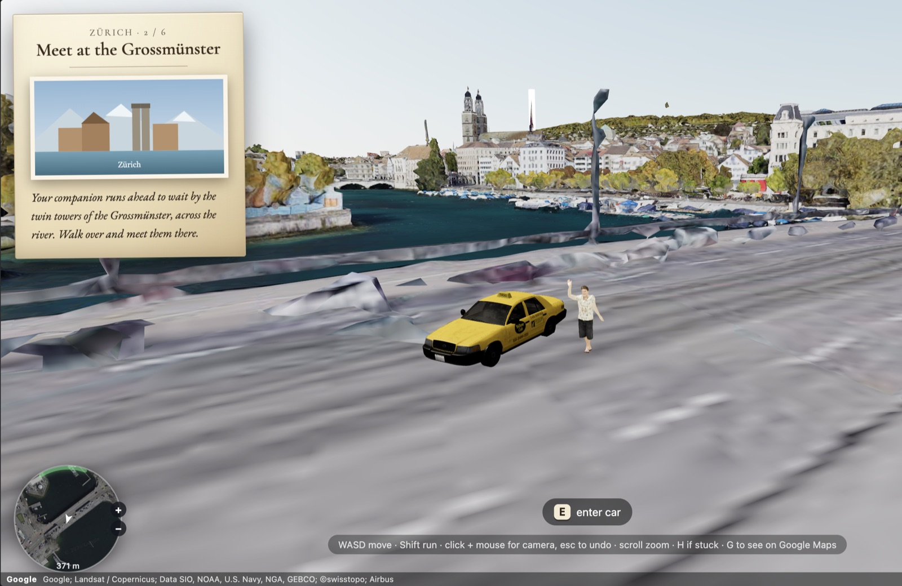

# Tilewalker Engine


*A browser game engine for walking a character through a real, streamed 3D city.*

Walk a rigged 3D character through a **real, live city**: Google's Photorealistic
3D Tiles streamed straight into the browser. Solve clues, reach glowing beacons,
and step into teleport vortexes that warp you across the map. The whole game
(locations, clues, companions, vehicles, sounds, minigames) is authored in a single
**`game.json`**, so changing the story takes no rebuild.

The bundled demo is a short six-stage walk through **Zürich** that shows off every
engine feature once.

## What it does

- **Real streamed 3D tiles.** Google Photorealistic 3D Tiles of any city on Earth,
  loaded live in the browser.
- **WASD character control.** Camera-relative movement with walk and run gaits, a
  follow camera, and mouse-look orbit.
- **Story mode.** An ordered quest of stages authored in one `game.json`, each with
  a clue card and an arrival letter, with progress saved to the browser.
- **Teleporting.** Beacons that fade to black and warp you to another lat/lng
  anywhere on the map, with a travel caption over the fade.
- **Companion.** A second character that follows you, waits at a fixed spot, or
  hides, and can be pinned to a specific animation per stage.
- **Positional and ambient sound.** Cues that fill the scene, sit at a fixed point,
  or track a moving thing like the player, the companion, or the active beacon,
  with distance falloff, proximity gating, and one-shot triggers.
- **World interaction.** A drivable car you enter, steer, and park.
- **Minigames.** Drop-in modal games played on arrival, with one Space-in-rhythm
  example included.
- **Minimap.** A rotating radar with a Google 2D-tile underlay and a walking route
  computed from the Google Routes API.

Built with Vite + TypeScript, Three.js / React Three Fiber, and
[`3d-tiles-renderer`](https://github.com/NASA-AMMOS/3DTilesRendererJS).



---

## What this is (and isn't)

Tilewalker is a thin, opinionated game layer on top of real, streamed 3D city
tiles. You author a whole walking-quest game — locations, clues, a companion,
vehicles, sounds, minigames, teleports — in a single `game.json`, with no rebuild
and, for most games, no code.

It sits in a gap between tools that each do part of the job:

| Tool | What it gives you | What it doesn't |
|---|---|---|
| **[3d-tiles-renderer](https://github.com/NASA-AMMOS/3DTilesRendererJS)** | Streams and renders the Google 3D tiles | No character, quest, camera, sound, or game loop — Tilewalker is built on top of it and adds those |
| **[CesiumJS](https://cesium.com/)** | A full geospatial globe SDK | A heavy globe/GIS framework; you write the whole app and gameplay yourself |
| **Google Earth Studio** | Cinematic camera paths over Earth | A rendering/animation tool, not interactive — no player, no gameplay |
| **three.js / React Three Fiber** | A general 3D engine | Everything is from scratch; no maps, no city, no authoring format |
| **Mapbox / MapLibre** | Fast 2D/2.5D map rendering | Not walkable photoreal 3D; no character or quest model |

The trade-off is deliberate: Tilewalker isn't a general engine. It does one thing —
a rigged character walking a scripted route through a real city — and makes that
thing authorable in JSON. If your game fits that shape, you get it almost for free.
If it doesn't, use one of the tools above.

---

## Get started

**1. Get a Google API key.** In the [Google Cloud Console](https://console.cloud.google.com/):
create a project, then enable **Map Tiles API** (the 3D city) and **Routes API**
(the minimap walking route). Create an API key.

> Set a daily quota on both APIs (APIs & Services → Quotas) as a runaway-cost
> guardrail. The tiles stream live every session and are billed per use.

**2. Configure the key.**

```bash
cp .env.example .env      # then paste your key into .env
```

**3. Run it.**

```bash
npm install
npm run dev               # → http://localhost:5173
```

Or with Docker (source is bind-mounted for hot-reload):

```bash
docker compose up --build # → http://localhost:7261
```

Open the URL, click **Begin**, and walk.

### Controls

| Key | Action |
|---|---|
| `W` `A` `S` `D` | Move (camera-relative) |
| `Shift` | Run |
| Click canvas + move mouse | Orbit camera · scroll to zoom |
| `E` | Enter / exit a car when one is nearby |
| `C` | Summon a drivable car beside you (any stage) |
| `H` | Warp back to where the current stage started, if stuck |
| `G` | Open the current walk on Google Maps |
| `P` | *(dev)* debug panel: jump between stages, teleport anywhere, capture coords |

Reach the glowing beacon to trigger a stage's outcome, whether that's a letter, a
minigame, or a teleport. Progress is saved to `localStorage`, so a reload resumes
where you left off.

---

## Make it your own

The engine is generic. The demo content is just one `game.json`. To build your own
walk:

1. **Edit [`public/game.json`](public/game.json)** for locations, clue text, glow
   colours, teleports, companions, and sounds. It hot-reloads on save. The full
   field reference is in **[docs/game-json.md](docs/game-json.md)**.
2. **Find coordinates** by pressing `P` in dev to open the debug panel, walking to
   a spot, and hitting **REMEMBER**, which dumps copy-ready lat/lng to the console.
3. **Add a minigame** by dropping one file in `src/minigames/games/`, with no
   registration step. See **[docs/minigames.md](docs/minigames.md)**.
4. **Swap the character** by dropping a rigged glTF over `public/player.glb` (and
   `public/chris.glb` for the companion). Any avatar works as long as it's rigged;
   the engine plays whatever animation clips ship inside the `.glb`.
   - **Animations** are driven by clip name. `src/Character.tsx` lists the clips it
     expects (walk, run, a few idles, and extras like a wave, a dance, and squats)
     and picks one based on what the player is doing. Name your clips the same and
     it just works; otherwise remap the names at the top of that file to match your
     model. Per-stage clips like the companion's wave are set with `companionClip`
     in `game.json`, so you can pin any clip your model carries without touching
     code. See **[docs/architecture.md](docs/architecture.md)** for the animation
     state machine.

For how the engine works under the hood (coordinate system, teleport re-centering,
the phase machine, and the gotchas), see **[docs/architecture.md](docs/architecture.md)**.

---

## What's included

- `public/player.glb` and `public/chris.glb` are the player and companion avatars
  (rigged glTF on the same rig; the demo ships them as the same model).
- `public/plane.glb` and `public/car.glb` are example vehicles: one you board, one
  you drive.
- `src/minigames/games/punting.tsx` is one example minigame, a Space-in-rhythm
  poling game used by the Zürich demo. Copy it as a template.
- `public/audio/*.mp3` are a handful of placeholder ambient beds. Replace them with
  your own; the sound cues in `game.json` decide when each plays.

---

## Docs & contributing

The game is authored entirely in `public/game.json`; the engine itself is generic.
Before making non-trivial changes, read the docs:

- **[docs/architecture.md](docs/architecture.md)** — data flow, the coordinate /
  ECEF re-centering model, the phase machine, and the **critical gotchas** (no
  StrictMode, render-tiles-once, portal-to-scene-root, teleport re-center in the
  frame loop, ground-settle). Most of these are invisible to `tsc` and only show up
  at runtime, so don't re-break them.
- **[docs/game-json.md](docs/game-json.md)** — the authoring schema (every `Stage` /
  `SoundCue` field).
- **[docs/minigames.md](docs/minigames.md)** — the minigame contract and how the
  auto-discovery registry works.

---

## Notes & limitations

- Not really mobile support.. Can be made to support quite easily, though.
- Requires a live internet connection, since tiles are streamed and never cached
  (per Google's Terms of Service).
- Street-level photogrammetry can look "melted" up close. That's the source data,
  not a bug.

## Licensing

- The code is MIT licensed. See [`LICENSE`](LICENSE).
- Google Photorealistic 3D Tiles are used live under
  [Google's Terms of Service](https://cloud.google.com/maps-platform/terms). The
  mandatory attribution is always rendered over the canvas, and you are responsible
  for your own API key and its usage.
- The MIT license covers the engine code only, not the bundled assets. The `.glb`
  models (`public/*.glb`) and the audio beds (`public/audio/*.mp3`) carry whatever
  license their original source allows, so replace them with your own assets for any
  serious use.
